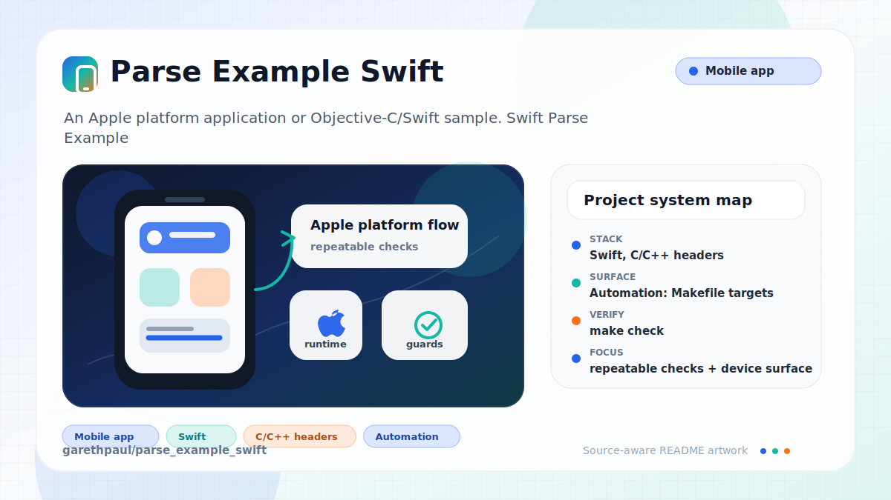

# parse_example_swift

<!-- README-OVERVIEW-IMAGE -->


## Overview

`garethpaul/parse_example_swift` is an Apple platform application or Objective-C/Swift sample. Swift Parse Example

This is a legacy Swift/Xcode scaffold. It does not currently include the Parse
SDK, Parse credentials, or an implemented backend login/data flow.

This README is based on the checked-in source, manifests, scripts, and repository metadata on the `master` branch. The project language mix found during review was: Swift (3), C/C++ headers (1).

## Repository Contents

- `parse_example` - source or example code
- `parse_example.xcodeproj` - Xcode project file
- `parse_exampleTests` - source or example code
- `Makefile` - local static verification entry point
- `CHANGES.md` - baseline change log
- `docs/plans/2026-06-08-parse-swift-baseline.md` - completed baseline plan
- `scripts/check-baseline.py` - static baseline checks used by `make check`
- `SECURITY.md` - security reporting and disclosure guidance
- `VISION.md` - project direction and maintenance guardrails

Additional scan context:

- Source directories: parse_example, parse_exampleTests
- Dependency and build manifests: Makefile
- Entry points or build surfaces: parse_example.xcodeproj, Makefile
- Test-looking files: parse_exampleTests/Info.plist, parse_exampleTests/parse_exampleTests.swift

## Getting Started

### Prerequisites

- Git
- macOS with Xcode for building Apple platform projects

### Setup

```bash
git clone https://github.com/garethpaul/parse_example_swift.git
cd parse_example_swift
```

The setup commands above are derived from repository files. Legacy mobile, Python, or JavaScript samples may require older SDKs or package versions than a modern workstation uses by default.

## Running or Using the Project

- Open `parse_example.xcodeproj` in Xcode, choose the app or sample scheme, and run it on the matching simulator/device.
- Run `make check` before changing the project scaffold, plist/storyboard
  files, or Parse integration assumptions.
- The test target keeps a non-placeholder XCTest that verifies the app bundle
  identifier is configured as a non-empty bundle identifier.
- Static checks preserve plist bundle identifiers and plist package types:
  `APPL` for the app and `BNDL` for the XCTest bundle.
- The storyboard initial view controller must stay connected to the checked-in
  `ViewController` Swift class.
- The main storyboard plist entry must keep `UIMainStoryboardFile` pointed at
  `Main`.
- Xcode project and native target default configurations stay explicit so the
  app and XCTest target default configurations remain deterministic.

## Testing and Verification

- `make check`
- `python3 scripts/check-baseline.py`
- Xcode's test action or `xcodebuild test` with the appropriate scheme and destination when Xcode is available

When the required SDK or runtime is unavailable, use static checks and source review first, then verify on a machine that has the matching platform toolchain.

## Configuration and Secrets

- No required secret or credential file was identified in the repository scan. If you add integrations later, keep secrets out of git.
- Do not commit Parse credentials, application IDs, client keys, production
  endpoints, or captured user data.

## Security and Privacy Notes

- Review changes touching network requests, sockets, or service endpoints; examples from the scan include parse_example/Info.plist, parse_exampleTests/Info.plist.
- Review changes touching file, media, JSON, XML, CSV, OCR, or data parsing; examples from the scan include parse_example/Info.plist, parse_exampleTests/Info.plist.

## Maintenance Notes

- This looks like an Apple platform project or sample. Xcode, Swift, CocoaPods, and deployment target versions may need to match the original project era.
- Keep non-placeholder XCTest coverage in place before adding Parse SDK calls or
  service-backed flows.
- Keep the non-empty bundle identifier assertion in place for scaffold changes.
- Keep plist bundle identifiers and plist package types intact when editing app
  or test target metadata.
- Keep the storyboard initial view controller bound to `ViewController` when
  editing Interface Builder files.
- Keep the main storyboard plist entry aligned with the checked-in `Main`
  storyboard.
- Keep target default configurations explicit when editing Xcode project
  metadata.
- See `CHANGES.md` and `docs/plans/2026-06-08-parse-swift-baseline.md` for
  the current static baseline.
- See `SECURITY.md` for vulnerability reporting and safe research guidance.
- See `VISION.md` for project direction and contribution guardrails.

## Contributing

Keep changes small and tied to the project that is already present in this repository. For code changes, document the toolchain used, avoid committing generated dependency directories or local configuration, and update this README when setup or verification steps change.
